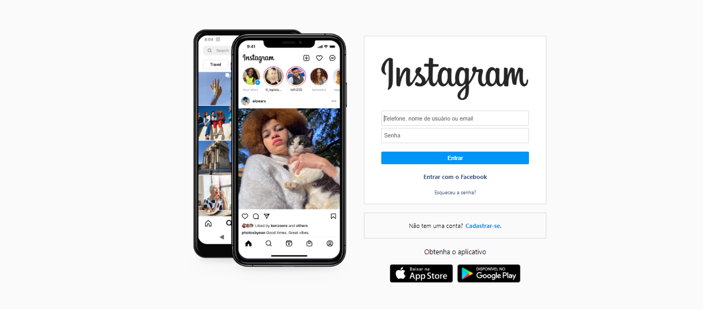

# Instagram

Project developed during a bootcamp by <a>Rodolfo Mori</a> called "Mission Programming from scratch"!

 Deploy: https://jecsm-instagram.netlify.app/
 
 
 <h2>💻 Technologies</h3> 
 
 ● HTML
  
 ● CSS
  
 ● JavaScript
 
 <h3>📌 DevOps</h3>
 
 <h4>● HTML</h4>

◦ Structuring the page

◦ Semantics

◦ Accessibility

◦ SEO

<h4>● CSS</h4>

◦ Placements

◦ Pseudo-elements

◦ Pseudo-classes

◦ Flexbox

◦ Animations

<h4>● JavaScript</h4>

◦ Introduction to JavaScript

◦ Manipulação do DOM

◦ Introdução ao Firebase</>

◦ Integração com o Firebase
 
 
<b>💬 Ask me about Click here</b>✨
 
 

